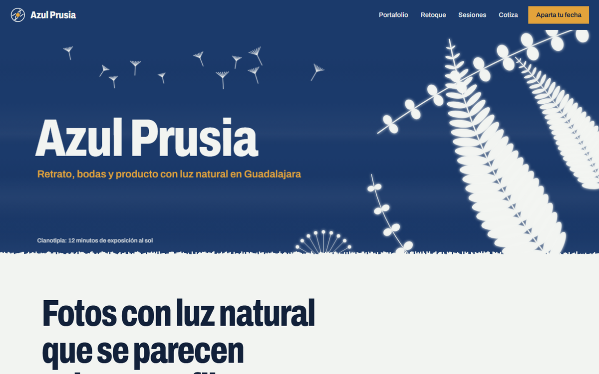
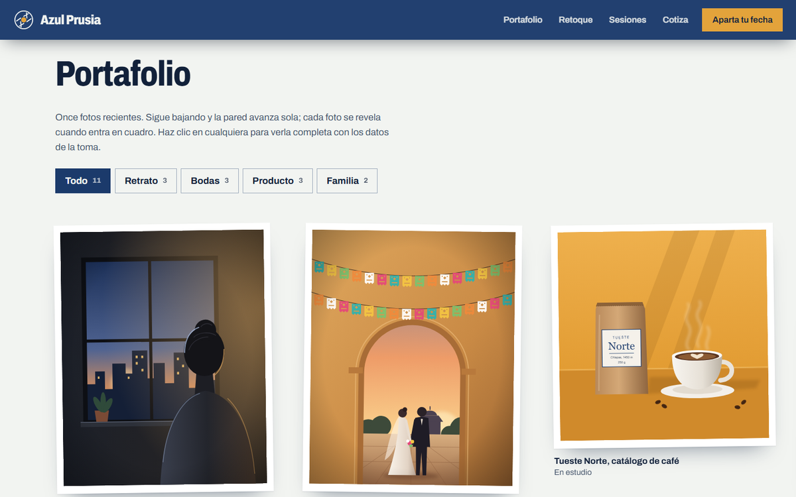
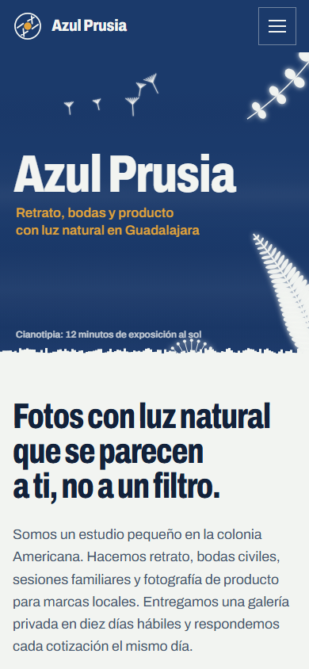

# Azul Prusia: estudio de fotografía

Página 4 de la práctica de **gráficos con canvas** del curso Desarrollo Web I. Es el sitio de un estudio de retrato, bodas, sesiones familiares y fotografía de producto en la colonia Americana de Guadalajara.

| | |
|---|---|
| **Tema** | Servicio de fotografía |
| **Técnica de canvas** | Banner en el encabezado |
| **Carpeta** | [`cuarta pagina/`](../../cuarta%20pagina/) |



## Canvas: banner en el encabezado

El `<canvas id="banner">` está dentro del `<header>`, debajo del menú, y ocupa todo el ancho de la pantalla. Dibuja un rectángulo azul con el nombre del sitio y la frase "Retrato, bodas y producto con luz natural en Guadalajara" en colores contrastantes.

La idea viene de la **cianotipia**, una de las primeras técnicas de la fotografía. Al cargar la página, el rectángulo pasa de amarillo verdoso a azul de Prusia en tres segundos mientras un contador dice "Exponiendo al sol". Las siluetas de helechos, ramas y semillas quedan en blanco, como si hubieran tapado la luz sobre el papel, y el borde inferior es irregular, como papel rasgado. Al mover el mouse, las plantas se desplazan un poco.

El canvas se redibuja al cambiar el tamaño de la ventana, usa `devicePixelRatio` para verse nítido y lee los colores de la paleta con `getComputedStyle`.

## Paleta

| Color | Hex | Uso |
|---|---|---|
| Azul de Prusia | `#1B3A6B` | Fondo del banner, encabezado y pie |
| Papel de algodón | `#F2F4F1` | Fondo de la página, texto del banner |
| Ámbar | `#E3A33B` | Acentos: frase del banner, botón "Aparta tu fecha", total del cotizador |

**Tipografía:** Archivo, con su eje de ancho condensado para los títulos.

## Secciones y funciones

- **Portafolio:** once fotografías ilustradas en SVG en una pared que avanza de lado mientras bajas. Cada foto "se revela" al entrar en cuadro, como en el cuarto oscuro. Los filtros por retrato, bodas, producto o familia reacomodan la pared con una transición animada.
- **Visor:** al abrir una foto, la imagen crece desde su lugar hasta la pantalla completa y aparecen los datos de la toma (lente, apertura, velocidad e ISO) y las miniaturas. Se maneja con flechas del teclado o deslizando el dedo.
- **Enfoque:** en computadora, unas esquinas de enfoque siguen al cursor y se ajustan al borde de la foto que tiene debajo.
- **Del archivo a la foto final:** un deslizador compara la foto sin editar y editada, y el histograma cambia al mismo tiempo.
- **Sesiones y precios:** cuatro paquetes presentados como sobres de laboratorio, desde ₡65 000. Al pasar el mouse, la foto sale del sobre.
- **Cotiza en un minuto:** el recibo se imprime al momento con el total en un contador de rodillos, el anticipo del 30 % y la fecha de entrega en días hábiles. La cotización se puede pasar directo al formulario de reserva.
- **Cómo trabajamos:** los cinco pasos en una tira de negativos.
- **Aparta tu fecha:** calendario con días libres, con pocos horarios y llenos. El formulario valida los datos y ofrece un recordatorio `.ics` para el calendario.
- **Preguntas frecuentes** y un pie que dice si el estudio está abierto en ese momento.



## Estructura

```
cuarta pagina/
├── index.html          redirige a public/index.html
├── css/estilos.css
├── js/pagina4.js
├── img/                13 ilustraciones SVG
└── public/index.html   la página
```

`public/index.html` enlaza su CSS y su JS subiendo un nivel: `../css/estilos.css` y `../js/pagina4.js`. Dentro de `public/` solo está el HTML, sin CSS ni JavaScript mezclados.

## Requisitos de la práctica

- [x] Encabezado (`<header>`) con el nombre del sitio y un menú con cinco enlaces internos
- [x] Canvas en forma de banner: rectángulo de color dentro del encabezado, debajo del menú, con nombre y frase en texto contrastante
- [x] Nueve secciones (`<section>`) con texto propio sobre el tema
- [x] Pie de página (`<footer>`) con ubicación, horario y contacto
- [x] Tres colores de una misma paleta usados en el canvas, el encabezado y los acentos
- [x] HTML, CSS y JavaScript en carpetas separadas
- [x] Imágenes SVG
- [x] Responsive en computadora y celular
- [x] Animaciones, transiciones y transformaciones

## Responsive

1. La etiqueta de viewport en el `<head>`:
   ```html
   <meta name="viewport" content="width=device-width, initial-scale=1.0">
   ```
2. El canvas nunca es más ancho que su contenedor y su alto se ajusta en proporción:
   ```css
   canvas {
     max-width: 100%;
     height: auto;
   }
   ```
3. Al final de `css/estilos.css`, una media query para pantallas de menos de 640 px que acomoda el menú y los paquetes en una sola columna:
   ```css
   @media (max-width: 639px) {
     .nav__lista { flex-direction: column; }
     .sobres { grid-template-columns: 1fr; }
   }
   ```



## Cómo verla

No necesita servidor ni instalación. Abre con doble clic el `index.html` de la carpeta `cuarta pagina`.

Las tipografías se cargan desde Google Fonts, así que se ve mejor con conexión a internet. Sin conexión, el navegador usa fuentes del sistema.

## Tecnologías

- **HTML5:** estructura semántica, `<dialog>` para el visor, formularios accesibles
- **CSS3:** variables, Grid, Flexbox, `clamp()`, `font-stretch` con el eje de ancho de Archivo, `mask-composite` para el boleto de la próxima fecha, `:has()`, animaciones ligadas al scroll (`animation-timeline`), animaciones y transiciones
- **JavaScript sin librerías:** Canvas 2D, View Transitions API (filtros y visor), Web Animations API, `IntersectionObserver`, `localStorage` y archivos `.ics` generados en el navegador
- **SVG:** 13 ilustraciones hechas para este sitio

## Notas

- El estudio, las personas, la dirección, el teléfono y el correo son **ficticios**.
- Los precios están en **colones costarricenses (CRC)** con el formato de Costa Rica, por ejemplo ₡65 000. El navegador los genera con `Intl.NumberFormat('es-CR', { currency: 'CRC' })`.
- Los formularios no envían datos a ningún servidor. Al terminar, abren la aplicación de correo con el mensaje listo y lo avisan en pantalla. Las solicitudes se guardan solo en el navegador de quien visita.
- Las animaciones respetan la opción de **reducir movimiento** del sistema operativo. La página se puede recorrer con el teclado.
- Algunas animaciones usan funciones recientes del navegador (transiciones de vista y animaciones ligadas al scroll). En navegadores que no las tienen, la página funciona igual, sin ese efecto.

---

Proyecto académico de Desarrollo Web I.
